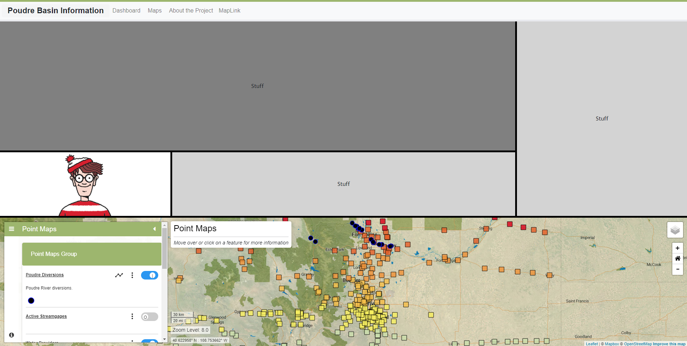
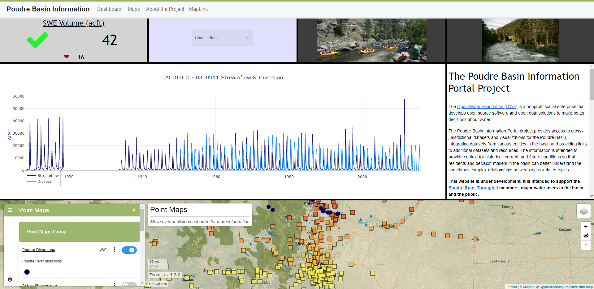

# InfoMapper / Dashboard / Adding a Dashboard #

Dashboards allow users to display critical information using interactive 'widgets'
on a single screen. This can help viewing top level information easily at a glance.
This section describes how to configure necessary files to create and show a
Dashboard in an application.

## Adding a dashboard to app-config.json ##

Adding a dashboard to an application can be done by first adding it as a navigation
bar button in the main `app-config.json` file, which can look similar to the following:

```json
{
  "name": "Dashboard",
  "action": "dashboard",
  "id": "test-dashboard",
  "dashboardFile": "/dashboard/dashboard.json",
  "tooltip": "Display the application dashboard",
  "visible": true
}
```

More information on the application configuration file can be found in the
[Install and Config appendix](../appendix-install/app-config.md).

## Configuration file ##

**NOTE: This is a work in progress and will likely change until this message
is removed.**

The following tables describe each dashboard configuration mandatory and optional
properties, with a simple example at the end. Each section describes the "object"
in the file.

### metadata ###

| **Property** | **Description** | **Default** |
| ---- | ---- | ---- |
| author | The name of creator of this dashboard configuration file. | None. |
| title | The title of this dashboard configuration. | None. |
| version | The version of this dashboard configuration. | None. |

### layout ###

| **Property** | **Description** | **Default** |
| ---- | ---- | ---- |
| columns<br>**required** | The number of columns to create in the dashboard. | None - must be specified. |
| backgroundColor | The background color of the container behind all widgets in the dashboard. | `white` |
| gutterSize | The amount of pixels separating each Widget in the dashboard. | `1` |

### widgets ###

A widget is a mini-report that shows data in many different presentation styles,
which includes tables, charts, and images. The **widgets** property takes an array
of one or more **widget** objects. Different widgets can sometimes take different
properties from others. This table lists each widget that can be displayed in the
dashboard, with a link to the list of the properties it uses. If a widget is still
under active development, it will show **WIP** (work in progress) under the
**Widget name** header property in the table.

> **NOTE:** All paths used in widget properties can either be absolute to the project (usually
`src/`), or relative to the dashboard configuration.

| **Widget name**&nbsp;&nbsp;&nbsp;&nbsp;&nbsp;&nbsp;&nbsp;&nbsp;&nbsp;&nbsp;&nbsp;&nbsp;&nbsp;&nbsp;&nbsp;&nbsp;&nbsp;&nbsp;&nbsp;&nbsp;&nbsp;&nbsp;&nbsp;&nbsp;&nbsp;&nbsp;&nbsp;&nbsp;&nbsp;&nbsp; | **Description** | **Link** |
| ---- | ---- | ---- |
| Chart<br>**WIP** | Displays a Plotly chart using a graph template file created from [TSTool](https://learn.openwaterfoundation.org/owf-learn-tstool/). | [Chart Widget](./widget-chart.md) |
| Image | Displays a single image in the widget. | [Image Widget](./widget-image.md) |
| Map | Displays a standalone Common library map in the widget. | [Map Widget](./widget-map.md) |
| Selector<br>**WIP** | Select an item from a dropdown menu in the widget. | [Selector Widget](./widget-selector.md) |
| Status Indicator<br>**WIP** | Displays data, status icon, change icons, and a link if a status has been determined to be 'failing'. | [Status Indicator Widget](./widget-status-indicator.md) |
| Text | Shows text in the widget. All supported files and text types can be found in the Text Widget page. | [Text Widget](./widget-text.md) |
| **WIDGETS** | **TO BE** | **IMPLEMENTED** |
| Sparkline |  |  |
| Dial |  |  |
| Elevation Level |  |  |
| Image Gallery |  |  |
| iframe |  |  |
| Video |  |  |

### Dashboard configuration example file ###

The following is a simple configuration file example with the resulting dashboard
displayed after.

```json
{
  "metadata": {
    "author": "Dalinar Kholin",
    "title": "Test Dashboard",
    "version": "1.0.0"
  },
  "layout": {
    "columns": 4,
    "backgroundColor": "black",
    "gutterSize": 5
  },
  "widgets": [
    {
      "columns": 3,
      "rows": 2,
      "type": "stuff"
    },
    {
      "columns": 1,
      "rows": 3,
      "style": { "backgroundColor": "lightgrey" },
      "type": "stuff"
    },
    {
      "columns": 1,
      "rows": 1,
      "dataPath": "../img/waldo.png",
      "type": "image",
      "style": { "backgroundColor": "white" }    
    },
    {
      "columns": 2,
      "rows": 1,
      "type": "stuff",
      "style": { "backgroundColor": "lightgrey" }
    },
    {
      "columns": 4,
      "rows": 2,
      "dataPath": "/data-maps/map-configuration-files/point-geometry-map.json",
      "type": "map"
    }
  ]
}
```

### Resulting dashboard ###



**<p style="text-align: center;">
Simple Dashboard Example (<a href="../images/simple-dashboard.png">see full-size image</a>)
</p>**

### More complex dashboard example ##

The following is a more complex example of what a dashboard can display. The dashboard
configuration file is not shown.



**<p style="text-align: center;">
Complex Dashboard Example (<a href="../images/complex-dashboard.png">see full-size image</a>)
</p>**

