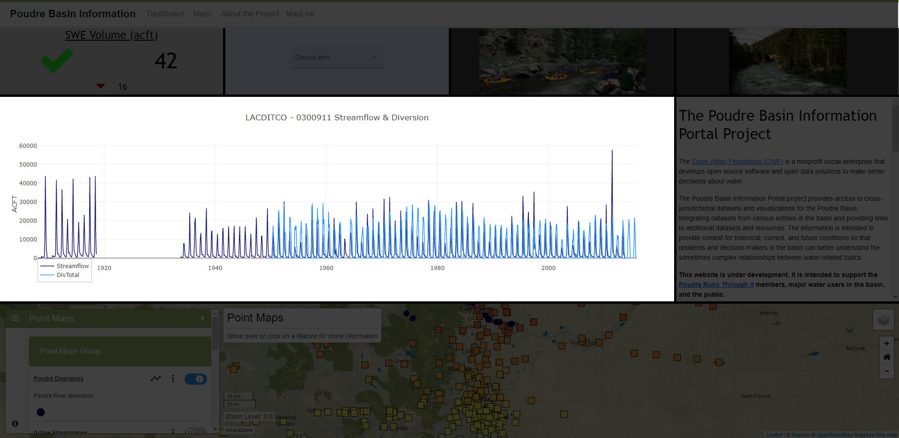

# InfoMapper / Dashboard / Chart Widget #

The Chart Widget is created as an object in the dashboard configuration file that
contains property names and its value.

## Creating a Chart Widget object ##

The following table describes every required/possible property that can be added
for displaying a Chart Widget on a dashboard.

| **Property**&nbsp;&nbsp;&nbsp;&nbsp;&nbsp;&nbsp;&nbsp;&nbsp;&nbsp;&nbsp;&nbsp;&nbsp;&nbsp;&nbsp;&nbsp;&nbsp;&nbsp;&nbsp;&nbsp;&nbsp;&nbsp;&nbsp;&nbsp;&nbsp; | **Description** | **Default** |
| ---- | ---- | ---- |
| `type`<br>**required** | The type of widget to create and display in the dashboard. The full list of available Chart Widget types are as follows:<br><ul><li>`chart` - Display a chart on the dashboard.</li></ul> | None - must be specified to be displayed. |
| `graphTemplatePath`<br>**required** | The path or URL to a TSTool created graph template file. More information can be found at the [TSTool Time Series Viewing Tools User Documentation](https://opencdss.state.co.us/tstool/latest/doc-user/appendix-tsview/tsview/#time-series-product-file-json-format). | None - must be specified. |
| `name`<br>**required** | A unique name for the widget used for identification. | None. |
| `description` | A description of what the widget will display on the dashboard. | None. |
| `columns` | The amount of columns the widget takes up. **NOTE:** The amount provided *must* be equal to or less than the number used for the **columns** property given in the [Dashboard layout](./add-dashboard.md#layout), or the dashboard will not create correctly. | `1` |
| `rows` | The amount of rows the widget takes up. | `1` |
| `eventHandlers` | An array of objects with data that adds a listener to this widget and listens to another widget. More information can be found in the [eventHandlers](#eventhandlers) table. | None |
| `style` | An object representing the styling of the widget. All available options are shown below in the [style](#style) table. | None |

### eventHandlers ###

| **Property** | **Description** | **Default** |
| ---- | ---- | ---- |
| `widgetName`&nbsp;&nbsp;&nbsp;&nbsp;&nbsp;&nbsp;&nbsp;&nbsp;&nbsp;&nbsp;&nbsp;&nbsp; | The name of the widget that this widget wants to listen to. This must match the name property of the widget. | None - must be specified. |
| `eventType` | A name of the desired eventType wanting to be used by this widget and sent from the above specified widget. The following are supported eventTypes for the Chart Widget:<ul><li>`SelectEvent`</li></ul> | None - must be specified. |

### style ###

| **Property** | **Description** | **Default** |
| ---- | ---- | ---- |
| `backgroundColor` | The background color of each widget. | `gray` |

----

## Chart Widget object ##

The following is an example of a simple Chart widget in the dashboard
configuration file, and what it looks like on a dashboard. 

```json
{
  "type": "chart",
  "name": "Chart test widget",
  "description": "A simple Chart widget on a dashboard.",
  "columns": 1,
  "rows": 1,
  "graphTemplatePath": "../graph-templates/multiple-graph-template.json",
  "eventHandlers": [
    {
      "widgetName": "Basin Selector",
      "eventType": "SelectEvent"
    }
  ],
  "style": {
    "backgroundColor": "lightgrey"
  }
}
```



**<p style="text-align: center;">
Simple Chart Widget Example (<a href="../images/simple-chart.png">see full-size image</a>)
</p>**