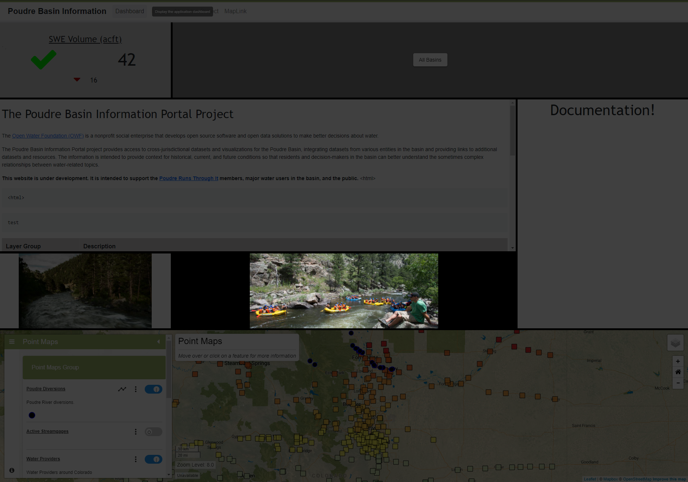

# InfoMapper / Dashboard / Image Widget #

The Image Widget is created as an object in the dashboard configuration file that
contains property names and its value.

## Creating an Image Widget object ##

The following table describes every required/possible property that can be added
for displaying a Image Widget on a dashboard.

| **Property**&nbsp;&nbsp;&nbsp;&nbsp;&nbsp;&nbsp;&nbsp;&nbsp;&nbsp;&nbsp;&nbsp;&nbsp;&nbsp;&nbsp; | **Description** | **Default** |
| ---- | ---- | ---- |
| `type`<br>**required** | The type of widget to create and display in the dashboard. The full list of available Image Widget types are as follows:<br><ul><li>`image` - Display a single image on the dashboard.</li></ul> | None - must be specified to be displayed. |
| `imagePath`<br>**required** | The path to the image file being used by this widget. Can either be an absolute path that assumes the project's `src/assets/app/` is the default home directory, or a relative path from the dashboard configuration file. | None - must be specified. |
| `name`<br>**required** | A unique name for the widget used for identification. | None. |
| `description` | A description of what the widget will display on the dashboard. | None. |
| `columns` | The amount of columns the widget takes up. **NOTE:** The amount provided *must* be equal to or less than the number used for the **columns** property given in the [Dashboard layout](./add-dashboard.md#layout), or the dashboard will not create correctly. | `1` |
| `rows` | The amount of rows the widget takes up. | `1` |
| `style` | An object representing the styling of the widget. All available options are shown below in the **style** table. |  |

### style ###

| **Property** | **Description** | **Default** |
| ---- | ---- | ---- |
| `backgroundColor` | The background color of each widget. | `gray` |

----

## Image Widget object ##

The following is an example of a simple Image widget in the dashboard configuration
file, and what it looks like on a dashboard. 

```json
{
  "type": "image",
  "imagePath": "/img/cache_la_poudre.jpg",
  "name": "Simple Image Widget",
  "description": "An image of the Cache la Poudre river.",
  "columns": 2,
  "rows": 1,
  "style": {
    "backgroundColor": "black"
  }
}
```



**<p style="text-align: center;">
Simple Image Widget Example (<a href="../images/simple-image.png">see full-size image</a>)
</p>**