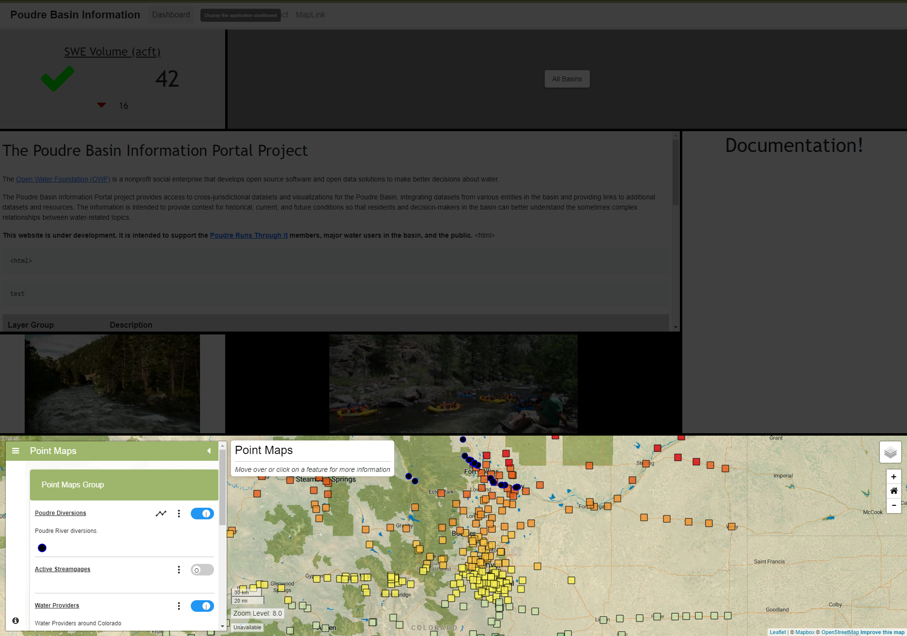

# InfoMapper / Dashboard / Map Widget #

The Map Widget is created as an object in the dashboard configuration file that
contains property names and its value.

## Creating a Map Widget object ##

The following table describes every required/possible property that can be added
for displaying a Map Widget on a dashboard.

| **Property** | **Description** | **Default** |
| ---- | ---- | ---- |
| type<br>**required** | The type of widget to create and display in the dashboard. The full list of available widget types are as follows:<br><ul><li>`map` - Display a standalone map using a map configuration file.</li></ul> | None - must be specified to be displayed. |
| dataPath<br>**required** | The path to a map configuration file being used by this widget. Can either be an absolute path that assumes the project's `src/assets/app/` is the default home directory, or a relative path from the dashboard configuration file. More information on creating a map configuration file can be found at the [InfoMapper GeoMapProject Documentation](https://software.openwaterfoundation.org/geoprocessor/latest/doc-user/appendix-geomapproject/geomapproject/). | None - must be specified. |
| name | A name for the widget. | None. |
| description | A description of what the widget will display on the dashboard. | None. |
| columns | The amount of columns the widget takes up. **NOTE:** The amount provided *must* be equal to or less than the number used for the **columns** property given in the main dashboard layout above, or else the dashboard will not create correctly. | `1` |
| rows | The amount of rows the widget takes up. | `1` |
| style | An object representing the styling of the widget. All available options are shown below in the **style** table. Note that the map widget covers the entire area of the widget, so setting any additional styling like the background will not be seen.  |  |

### style ###

| **Property** | **Description** | **Default** |
| ---- | ---- | ---- |
| backgroundColor | The background color of each widget. | `gray` |

----

## Simple Map Widget object ##

The following is an example of a simple map widget in the dashboard configuration
file, and what it looks like on a dashboard. 

```json
{
  "type": "map",
  "dataPath": "/data-maps/map-configuration-files/point-geometry-map.json",
  "name": "Simple Map Widget",
  "description": "A standalone map with simple point features and events.",
  "columns": 4,
  "rows": 2
}
```



**<p style="text-align: center;">
Simple Map Widget Example (<a href="../../images/simple-map.png">see full-size image</a>)
</p>**