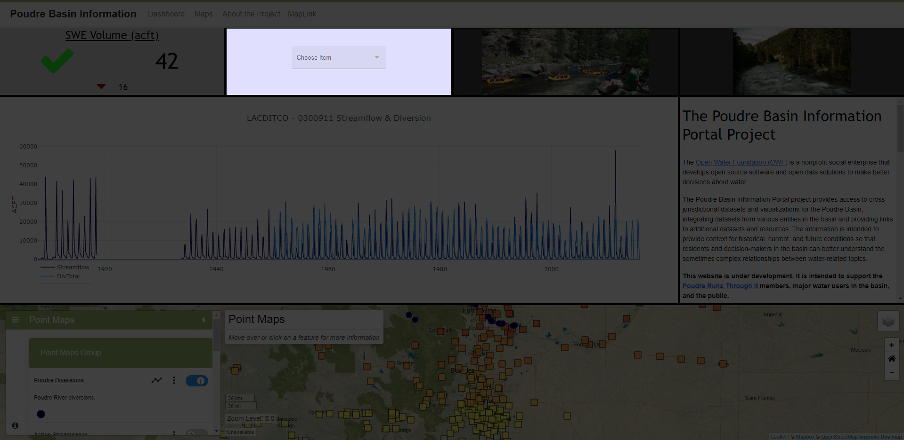
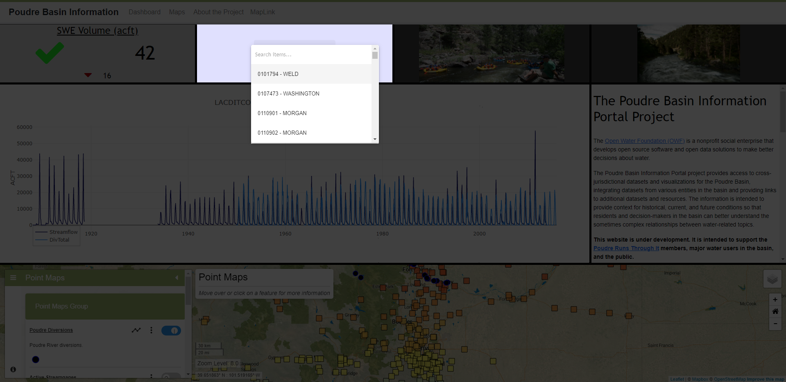

# InfoMapper / Dashboard / Selector Widget #

The Selector Widget is created as an object in the dashboard configuration file that
contains property names and its value.

## Creating a Selector Widget object ##

The following table describes every required and possible property that can be added
for displaying a Selector Widget on a dashboard.

| **Property**&nbsp;&nbsp;&nbsp;&nbsp;&nbsp;&nbsp;&nbsp;&nbsp;&nbsp;&nbsp;&nbsp;&nbsp;&nbsp;&nbsp;&nbsp;&nbsp;&nbsp;&nbsp;&nbsp;&nbsp;&nbsp;&nbsp; | **Description** | **Default** |
| ---- | ---- | ---- |
| `type`<br>**required** | The type of widget to create and display in the dashboard. The full list of available Selector Widget types are as follows:<br><ul><li>`selector` - Display a selection dropdown in the widget.</li></ul> | None - must be specified to be displayed. |
| `dataPath`<br>**required** | The path or URL to the data file being used by this widget. Can either be an absolute path that assumes the project's `src/assets/app/` is the default home directory, or a relative path from the dashboard configuration file. The `dataFormat` property below must describe what kind of data is being retrieved. | None - must be specified. |
| `dataFormat`<br>**required** | A string representing what type of data will be retrieved. More in depth information on how to confirm a certain data format is used correctly can be found in the [Data Formats](./dataFormat.md#data-formats) section. The list of supported data types are as follows (case insensitive):<br><ul><li>`CSV`</li><li>`GeoJSON`</li><li>`JSON`</li></ul> | None - must be specified. |
| `displayName`<br>**required** | The string to be displayed for each option in the Selector dropdown. `${}` property notation is supported. This way data property values can be used, e.g. `${property:wdid} - ${property:county}` would display `0300911 - LARIMER` for one option, `0404634 - LARIMER` for another, etc. | None - must be specified. |
| `JSONArrayName`<br>**required**<sup>*</sup> | Used for JSON data retrieval. This tells the Selector widget what the name of the array in the read in JSON object is, so it can be used to populate the selector's dropdown choices. This *must* be used when reading in JSON data, but may change later. More information can be found under the [JSON](#json) section. | None - must be specified for JSON data. |
| `name`<br>**required** | A unique name for the widget used for identification. | None. |
| `skipDataLines` | The number of "lines" to skip in a data file. For example, CSV files from CDSS web services return two header lines: The first are headers for metadata, taking up 2 lines, and the second are the headers for the dataset itself. Setting `skipDataLines` to `2` would skip over the extraneous lines and process the rest. This is only used with the `CSV` dataFormat. | None |
| `description` | A description of what the widget will display on the dashboard. | None. |
| `columns` | The amount of columns the widget takes up. **NOTE:** The amount provided *must* be equal to or less than the number used for the **columns** property given in the [Dashboard layout](./add-dashboard.md#layout), or the dashboard will not create correctly. | `1` |
| `rows` | The amount of rows the widget takes up. | `1` |
| `style` | An object representing the styling of the widget. All available options are shown below in the **style** table. |  |

### style ###

| **Property** | **Description** | **Default** |
| ---- | ---- | ---- |
| `backgroundColor` | The background color of each widget. | `gray` |

## Selector Widget object ##

The following is an example of a simple selector widget in the dashboard configuration
file, and what it looks like on a dashboard. This object would be added to the
dashboard configuration's **widgets** array.

```json
{
  "type": "selector",
  "name": "Simple Selector Widget",
  "description": "A hard coded selector widget for testing.",
  "columns": 1,
  "rows": 1,
  "dataPath": "https://dwr.state.co.us/path/to/some/data/?format=json",
  "dataFormat": "JSON",
  "displayName": "${property:wdid} - ${property:county}",
  "style": {
    "backgroundColor": "#e0e0ff"
  }
}
```

### Initial Selector display ###



**<p style="text-align: center;">
Simple Selector Widget Example (<a href="../images/simple-selector.png">see full-size image</a>)
</p>**

### Selector opened ###



**<p style="text-align: center;">
Simple Selector opened Widget Example (<a href="../images/simple-selector-open.png">see full-size image</a>)
</p>**