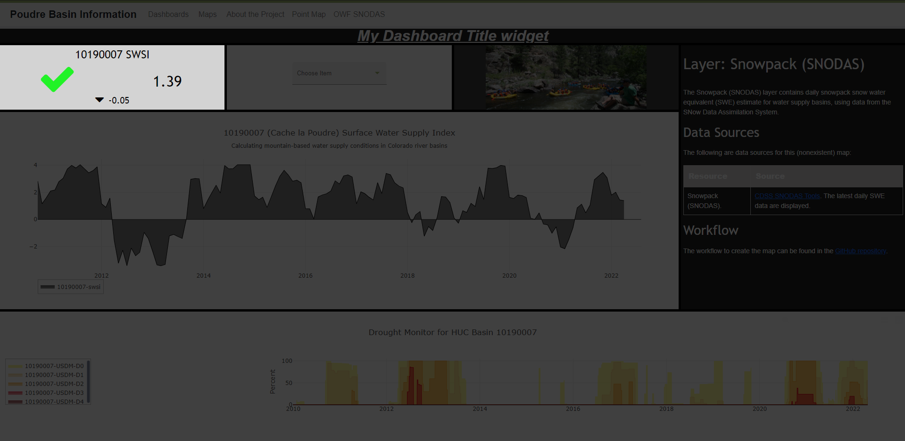

# InfoMapper / Dashboard / Status Indicator Widget #

The Status Indicator Widget is created as an object in the dashboard configuration file that
contains property names and its value.

## Creating a Status Indicator Widget object ##

The following table describes every required/possible property that can be added
for displaying a Status Indicator Widget on a dashboard.

| **Property**&nbsp;&nbsp;&nbsp;&nbsp;&nbsp;&nbsp;&nbsp;&nbsp;&nbsp;&nbsp; | **Description** | **Default** |
| ---- | ---- | ---- |
| `type`<br>**required** | The type of widget to create and display in the dashboard. The full list of available Status Indicator Widget types are as follows:<br><ul><li>`statusIndicator` - Display a status indicator on the dashboard.</li></ul> | None - must be specified to be displayed. |
| `name`<br>**required** | A unique name for the widget used for identification. | None. |
| `dataPath`<br>**required**<sup>*</sup> | The path or URL to the data file being used by this widget. Can either be an absolute path that assumes the project's `src/assets/app/` is the default home directory, or a relative path from the dashboard configuration file. The `dataFormat` property below must describe what kind of data is being retrieved. | None - must be specified if not listening to another widget. |
| `dataFormat`<br>**required**<sup>*</sup> | A string representing what type of data will be retrieved. More in depth information on how to confirm a certain data format is used correctly can be found in the [Data Formats](./dataFormat.md#data-formats) section. The list of supported data types are as follows (case insensitive):<br><ul><li>`CSV`</li><li>`GeoJSON`</li><li>`JSON`</li></ul> | None - must be specified if not listening to another widget. |
| `attributeName`, `columnName`, or `propertyName`<br>**required**<sup>*</sup> | Only one of these options need to be used, and all will be used the same way. These options exist for easier readability and context. If JSON data is being retrieved, `propertyName` would make more sense, and if CSV is needed, `columnName` can be used. | None - must be specified if not listening to another widget. |
| `skipDataLines` | Can be used to tell the Indicator widget to skip lines in CSV data. This can be used if the data has multiple header lines. More information can be found under the [CSV](./dataFormat.md#csv) section in Data Formatting. |  |
| `title` | The title to be displayed at the top of the widget. | None - must be specified to be displayed. |
| `description` | A description of what the widget will display on the dashboard. | None. |
| `columns` | The amount of columns the widget takes up. **NOTE:** The amount provided *must* be equal to or less than the number used for the **columns** property given in the [Dashboard layout](./add-dashboard.md#layout), or the dashboard will not create correctly. | `1` |
| `rows` | The amount of rows the widget takes up. | `1` |
| `eventHandlers` | An array of objects with data that adds a listener to this widget and listens to another widget. More information can be found in the [eventHandlers](#eventhandlers) table. **NOTE: This feature is still a work in progress.** | None. |
| `style` | An object representing the styling of the widget. All available options are shown below in the **style** table. |  |
| ============= | ======================================================= | ========== |
| <b>*</b> | These properties are only required if an eventHandler is not being used. For example, if a `SelectEvent` is added and this widget is listening to a Selector Widget, the data will have already been retrieved by that widget. If no eventHandler is given, it is assumed that this widget will get and process the data. In that case, it needs to know where it gets the data (`dataPath`), what kind of data is being retrieved (`dataFormat`), and the name of the desired value to display (`attributeName, etc.`). |  |

### eventHandlers ###

| **Property** | **Description** | **Default** |
| ---- | ---- | ---- |
| `widgetName`&nbsp;&nbsp;&nbsp;&nbsp;&nbsp;&nbsp;&nbsp;&nbsp;&nbsp;&nbsp;&nbsp;&nbsp; | The name of the widget that this widget wants to listen to. This must match the name property of the widget. | None - must be specified. |
| `eventType` | A name of the desired eventType wanting to be used by this widget and sent from the above specified widget. The following are supported eventTypes for the Chart Widget:<ul><li>`SelectEvent`</li></ul> | None - must be specified. |


### style ###

| **Property** | **Description** | **Default** |
| ---- | ---- | ---- |
| `backgroundColor` | The background color of each widget. | `gray` |

----

## Status Indicator Widget object ##

The following is an example of a simple Status Indicator widget in the dashboard
configuration file, and what it looks like on a dashboard. 

```json
{
  "type": "statusIndicator",
  "name": "Status Indicator test widget",
  "description": "A simple Status Indicator widget on a dashboard.",
  "columns": 1,
  "rows": 1,
  "title": "SWE Volume (acft)",
  "dataPath": "https://data.colorado.gov/resource.json",
  "dataFormat": "JSON",
  "propertyName": "swsi",
  "style": {
    "backgroundColor": "lightgrey"
  }
}
```

**The image will be added after the widget development is closer to completion.**



**<p style="text-align: center;">
Simple Status Indicator Widget Example (<a href="../images/simple-status-indicator.png">see full-size image</a>)
</p>**