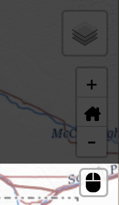

# InfoMapper / Story / Adding a Story

**NOTE: This section is a work in progress and will likely change until this message
is removed.**

Stories can be used in applications by combining text, interactive maps, and other
multimedia content to tell an immersive narrative.

## Adding a story to `app-config.json` ##

Adding a story to an application can be done by first adding it as a navigation
bar button in the main `app-config.json` file. This can be a MainMenu or SubMenu,
which can look similar to the following:

```json
{
  "id": "test-story",
  "storyFile": "stories/test-story/test-story.json",
  "name": "Test Story",
  "action": "story"
}
```

More information on the application configuration file can be found in the
[Install and Config appendix](../appendix-install/app-config.md).

## Configuration file ##

The following tables describe each story configuration mandatory and optional
properties, with a simple example at the end. Each section describes the "object"
in the file.

### StoryConf ###

As of now the StoryConf object only takes a StoryMain object. More properties
might be added later.

| **Property** | **Description** | **Default** |
| ---- | ---- | ---- |
| `story`<br>**required** | A StoryMain object. | None - must be provided. |

### StoryMain ###

| **Property** | **Description** | **Default** |
| ---- | ---- | ---- |
| `name` | The name of the Story. Shown as the Story's home button in the Story main menu for direct navigation to the Story's first page of its first chapter. | None. |
| `chapters`<br>**required** | An array of StoryChapter objects. | None - must be provided. |

### StoryChapters ###

| **Property** | **Description** | **Default** |
| ---- | ---- | ---- |
| `name`<br>**required** | The name of the Chapter. Shown on the Story's main menu for direct navigation. | None. |
| `tooltip` | A tooltip for this chapter to be displayed on the story main menu button.  | None. |
| `pages`<br>**required** | A array of [Dashboard configuration objects](../appendix-adding-a-dashboard/add-dashboard.md#configuration-file). This is so each page can take advantage of the layout provided by a dashboard. The following are important Dashboard properties that the Story utilizes:<br><ul><li>`title` - The name of each Story page, and will be used as each page's tooltip in the story's side navigation list.</li><li>`id` - Used as a unique name and shown as an anchor in the site URL.</li></ul> | None - must be provided. |

### Story configuration file example ###

The following is a simple configuration file example with the resulting Story
displayed after.

```json
{
  "story": {
    "name": "Poudre Basin Example Story",
    "chapters": [
      {
        "name":"Text & Map Examples",
        "tooltip": "Text & Map page",
        "pages": [
          {
            "metadata": {
              "author": "Jon Snow",
              "title": "Text & Map",
              "id": "text-map-example-1",
              "version": "1.0.0"
            },
            "layout": {
              "columns": 4,
              "backgroundColor": "black",
              "gutterSize": 5
            },
            "widgets": [
              {
                "type": "text",
                "name": "Simple Markdown Text Widget",
                "description": "A widget that displays dashboard text and other useful information.",
                "textPath": "/data-ts/line-maps-group-doc.md",
                "contentType": "Markdown",
                "columns": 1,
                "rows": 1,
                "style": {
                  "backgroundColor": "#212121",
                  "textColor": "white"
                }
              },
              {
                "type": "map",
                "mapConfigPath": "data-maps/map-configuration-files/line-geometry-map.json",
                "name": "Simple Map widget for page 1",
                "columns": 3,
                "rows": 1
              }
            ]
          },
          {
            "metadata": {
              "author": "Jon Snow",
              "title": "Test Story Page 2",
              "id": "text-map-example-2",
              "version": "1.0.0"
            },
            "layout": {
              "columns": 4,
              "backgroundColor": "black",
              "gutterSize": 5
            },
            "widgets": [
              {
                "type": "text",
                "name": "Simple Markdown Text Widget",
                "description": "A widget that displays dashboard text and other useful information.",
                "textPath": "/data-ts/snodas.md",
                "contentType": "Markdown",
                "columns": 1,
                "rows": 1,
                "style": {
                  "backgroundColor": "#212121",
                  "textColor": "white"
                }
              },
              {
                "type": "map",
                "mapConfigPath": "data-maps/map-configuration-files/point-geometry-map.json",
                "name": "Simple Map widget for page 2",
                "columns": 3,
                "rows": 1
              }
            ]
          }
        ]
      },
      {
        "name":"All Text Examples",
        "pages": [
          {
            "metadata": {
              "author": "Jon Snow",
              "title": "Text",
              "id": "text-example-1",
              "version": "1.0.0"
            },
            "layout": {
              "columns": 4,
              "backgroundColor": "black",
              "gutterSize": 5
            },
            "widgets": [
              {
                "type": "text",
                "name": "Simple Markdown Text Widget",
                "description": "A widget that displays dashboard text and other useful information.",
                "textPath": "/data-ts/map-doc.md",
                "contentType": "Markdown",
                "columns": 4,
                "rows": 1,
                "style": {
                  "backgroundColor": "#212121",
                  "textColor": "white"
                }
              }
            ]
          }
        ]
      }
    ]
  }
}
```

### Resulting story ###

#### Page 1 ####


**<p style="text-align: center;">
Simple Story Page 1 Example (<a href="../images/simple-story-page-1.png">see full-size image</a>)
</p>**

#### Page 2 ####


**<p style="text-align: center;">
Simple Story Page 2 Example (<a href="../images/simple-story-page-2.png">see full-size image</a>)
</p>**

#### Page 3 ####


**<p style="text-align: center;">
Simple Story Page 3 Example (<a href="../images/simple-story-page-3.png">see full-size image</a>)
</p>**

### Basic Story usage ###

#### Story menu ####

Each story has its own menu, separate from the main application menu. It is located
directly below the main menu, and will display two sections: The story's 'main'
menu on the left, and each chapter in the story on the right. The story's main menu
will take the user to the story's first page of the first chapter. Each of the chapter
menu buttons will send the user to the first page of the selected chapter for easier
navigation within larger stories.

#### Navigation between pages ####

There are 4 ways to navigate around the story:

1. Using the story menu buttons mentioned above to go between chapters quickly.

2. Using the up & down arrow keys on the keyboard to navigate between pages. Note
that this method does not allow wrapping, so pressing down on the last page of the
story will not wrap and start back at the first page of the first chapter.

3. Clicking on each desired page circle in the navigation bar on the right side of
the story. A tooltip will describe what the page is about when hovered over.

4. Scrolling the mouse wheel up or down to each page. Since the mouse can be over
one of many different types of data 'widgets', the following section will
go more into detail.

#### Scrolling ####

Updates for handling mouse scrolling was needed to make a better experience
for users. The following table describes different widgets and their scrolling behavior
when shown in a story.

| **Widget** | **Default scrolling behavior** | **Story scrolling behavior** |
| ---- | ---- | ---- |
| **Map** | Zoom in and out of the map. | By default, mouse scroll navigates the Story page forwards and backwards. This can be toggled by using the mouse scroll Leaflet control, which is located in the upper right part of the map.<br></img> |
| **Text** | Scroll through the text widget if applicable. | Only scrolls through the widget, and does not keep scrolling when either the top or bottom of the text widget is hit. For example, will not scroll to the following page while the mouse is in the text widget. |