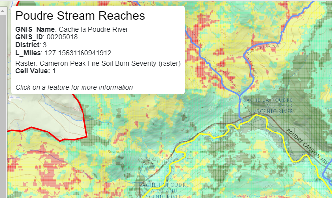

# Map Event Configuration File #

* [Introduction](#introduction)
* [Hover Event](#hover-event)
* [Click Event](#click-event)
* [Event Configuration File Properties](#event-configuration-file-properties)
	+ [Raster Layer Event Configuration](#raster-layer-event-configuration)

--------------------

## Introduction ##

A map configuration file created by GeoProcessor software
can contain an event handler section for GeoLayerView,
with event handler configuration as discussed below.
This allows interaction with map layers,
such as hovering over features or clicking on features in order to view additional information.

One or more event handlers can be added to a GeoMapProject using the GeoView
[`SetGeoLayerViewEventHandler`](http://software.openwaterfoundation.org/geoprocessor/latest/doc-user/command-ref/SetGeoLayerViewEventHandler/SetGeoLayerViewEventHandler/) command.
Default event handlers are often sufficient for many layers, especially when additional interaction is not needed.

## Hover Event ##

An `eventType` of `hover` will cause a transient popup dialog to display,
which shows attributes for the layer feature over which hovering occurs.
The hover event type is enabled by default and displays all the attributes for the feature under the hover device, typically a mouse.
Attributes that are URLs are **not** enabled as links because moving the mouse from the map the popup dialog
will cause the popup to close.  Use a click event to be able to click on URL links.
The following illustrates a hover popup.
Create an event configuration file to constrain the number of features displayed in the popup dialog.

**<p style="text-align: center;">

</p>**

**<p style="text-align: center;">
Example Popup for Hover Event (<a href="../images/hover-popup.png">see full-size image</a>)
</p>**

The following illustrates the GeoMapProject data for a GeoLayerView.
In this case the event configuration will constrain the attributes displayed
in hover and click popups to the same values
and therefore the same event configuration file can be used.

```
    "eventHandlers": [
      {
        "eventType": "hover",
        "name": "Hover event",
        "description": "Hover event configuration",
        "properties": {
          "eventConfigPath": "layers/wildfire-perimeters-event-config.json"
        }
      },
      {
        "eventType": "click",
        "name": "Click event",
        "description": "Click event configuration",
        "properties": {
          "eventConfigPath": "layers/wildfire-perimeters-event-config.json"
        }
      }
    ]
```

The corresponding `wildfire-perimeters-event-config.json` file contents are as follows.
See the [Event Configuration File Properties](#event-configuration-file-properties)
section for details.

```
{
  "id" : "wildfire-perimeters-event-config",
  "name": "Hover and click event handlers active wildfire perimeters",
  "description":  "Display only important user-understandable attributes.",
  "layerAttributes" : {
    "include" : [ "IncidentName", "MapMethod", "Comments", "GISAcres", "Label", "CreateDate", "DateCurrent", "PolygonDateTime" ],
    "exclude" : [],
    "formats": []
  },
  "actions": [
  ]
}
```

## Click Event ##

An `eventType` of `click` is associated with popup dialog that can be configured to show attributes for the layer feature
that was clicked on, and optionally show buttons that when clicked on will cause other actions such as displaying a
time series graph.
A click event is enabled by default and will show all feature attributes in a scrollable popup dialog.
Attributes that are URLs are enabled as links because the popup dialog will remain and the mouse can be moved over the link.
Create an event configuration file to constrain the number of features displayed in the popup dialog.
An event handler can be defined in map configuration file using GeoProcessor
[`SetGeoLayerViewEventHandler`](http://software.openwaterfoundation.org/geoprocessor/latest/doc-user/command-ref/SetGeoLayerViewEventHandler/SetGeoLayerViewEventHandler/)
command, for example:

```
  "eventHandlers": [
    {
      "eventType": "click",
      "name": null,
      "description": "",
      "properties": {
        "eventConfigPath": "graphs/diversion-popup-config.json"
      }
    }
  ]
```

The event configuration file specified by `popupConfigPath` property
indicates the appearance and functionality of the popup.
Currently, the GeoProcessor does not provide a command to create a popup configuration file
and therefore it must be created with a text editor.
The following is an example of a popup configuration file.
In this case the popup will list all attributes for the feature that has been
clicked on and will display buttons that trigger actions.
See the [Event Configuration File Properties](#event-configuration-file-properties)
section for details.

```
{
  "id" : "diversion-popup-config",
  "name": "Diversion popup configuration",
  "description":  "List main attributes and provide buttons to graph time series.",
  "layerAttributes" : {
    "include" : [ "*" ],
    "exclude" : [],
    "formats": []
  },
  "actions": [
      {
        "label" : "Demand",
        "action" : "displayTimeSeries",
        "resourcePath" : "graphs/diversion-DiversionDemand-graph-config.json",
        "downloadFile" : "${featureAttribute:StateModStationId}-DiversionDemand.csv"
      },
      {
        "label" : "Historical",
        "action" : "displayTimeSeries",
        "resourcePath" : "graphs/diversion-DiversionHistorical-graph-config.json",
        "downloadFile" : "${featureAttribute:StateModStationId}-DiversionHistorical.csv"
      },
      {
        "label" : "Available Flow",
        "action" : "displayTimeSeries",
        "resourcePath" : "graphs/diversion-Available_Flow-graph-config.json",
        "downloadFile" : "${featureAttribute:StateModStationId}-Available_Flow.csv"
      },
      {
        "label" : "Combination",
        "action" : "displayTimeSeries",
        "resourcePath" : "graphs/diversion-combination-graph-config.json",
        "downloadFile" : "${featureAttribute:StateModStationId}-combination.csv"
      },
      {
        "label" : "Diversion Summary",
        "action" : "displayText",
        "resourcePath" : "/data-ts/output/xdd/${featureAttribute:StateModStationId}.H2.xdd"
      }
  ]
}
```

For example, the popup will display similar to the following:

**<p style="text-align: center;">

</p>**

**<p style="text-align: center;">
Example Popup for Click Event (<a href="../images/click-popup.png">see full-size image</a>)
</p>**

## Event Configuration File Properties ##

The main properties of an event configuration file are described in the following table.

**<p style="text-align: center;">
Event Configuration File Main Properties
</p>**

| **Property**&nbsp;&nbsp;&nbsp;&nbsp;&nbsp;&nbsp;&nbsp;&nbsp;&nbsp;&nbsp;&nbsp;&nbsp;&nbsp;&nbsp;&nbsp;&nbsp;&nbsp;&nbsp; | **Description** | **Default** |
| -- | -- | -- |
| `id` | Identifier for the event configuration, which can be used internally by software. | |
| `name` | Name for the event configuration that can be displayed, for example to allow a user to select a configuration file. | |
| `description` | Description for the event configuration that can be displayed, for example to help a user understand the event. | |
| `layerAttributes` | Indicates which attributes to display and how to format those attributes (see details below). | All attributes will be shown. |
| `actions` | A list of actions that can be triggered by selecting buttons displayed in the popup (see details below). | No additional actions will be enabled (only attributes are shown in the popup). |

The following table describes properties for `layerAttributes`.

**<p style="text-align: center;">
Event Configuration File `layerAttributes` Properties
</p>**

| **Property** | **Description** | **Default**&nbsp;&nbsp;&nbsp;&nbsp;&nbsp;&nbsp;&nbsp;&nbsp;&nbsp;&nbsp;&nbsp;&nbsp;&nbsp;&nbsp;&nbsp;&nbsp;&nbsp;&nbsp;&nbsp;&nbsp;&nbsp;&nbsp;&nbsp;&nbsp; |
| -- | -- | -- |
| `include` | An array of string patterns indicating which layer attributes to include in the popup.  Specify as literal strings surrounded by single quotes.  The `*` character can be used in strings as a wildcard to match attributes. See the following examples:<ul><li>`[  ]` - include all attributes</li><li>`[ '*' ]` - include all attributes</li><li>`[ 'Attribute1', 'b*' ]` - include specific attribute named `Attribute1` and all attributes starting with `b`</li></ul>| Include all attributes. |
| `exclude` | An array of string patterns indicating which layer attributes to exclude in the popup, which will be processed after `include`.  Specify as literal strings surrounded by single quotes.  The `*` character can be used as a wildcard in strings to match attributes. See the examples for `include`.| Include all attributes (do not exclude any attributes). |
| `formats` | An array of properties defining how to format attributes.  **Need to define.** | Use default string representation of attributes. |

**<p style="text-align: center;">
Event Configuration File `actions` Properties
</p>**

| **Property**&nbsp;&nbsp;&nbsp;&nbsp;&nbsp;&nbsp;&nbsp;&nbsp;&nbsp;&nbsp;&nbsp;&nbsp;&nbsp;&nbsp;&nbsp;&nbsp;&nbsp;&nbsp; | **Description** | **Default**&nbsp;&nbsp;&nbsp;&nbsp;&nbsp;&nbsp;&nbsp;&nbsp;&nbsp;&nbsp;&nbsp;&nbsp;&nbsp;&nbsp;&nbsp;&nbsp;&nbsp;&nbsp;&nbsp;&nbsp;&nbsp;&nbsp;&nbsp;&nbsp;&nbsp;&nbsp;&nbsp;&nbsp;&nbsp;&nbsp;&nbsp;&nbsp; |
| -- | -- | -- |
| `action`<br>**required**</br> | The action type, indicating what will happen when the popup button defined by `label` is pressed:<ul><li>`displayTimeSeries` (previously was `graph`) - display a time series product specified by TSTool JSON graph configuration file</li><li>`displayText` - display a text file using a popup with fixed-format font</li></ul>. | None - must be specified. |
| `chartPackage` | The chart package to use for graphs:<ul><li>`ChartJS`</li><li>`plotly`</li></ul> | `plotly` |
| `downloadPath` | The name of the file to be used when downloading data used in a visualization popup.  Can use `${property}` notation and [property modifiers](app-config.md#property-modifiers). | <ul><li>`timeseries.csv` - for time series</li></ul> | 
| `label`<br>**required**</br> | The button label shown in the popup. | None - must be specified. |
| `productPath` | Deprecated - use `resourcePath`. | | 
| `resourcePath`<br>**required**</br> | The path to the data resource:<ul><li>for `action=displayTimeSeries`, specify a [TSTool JSON time series product](time-series-config-file.md) (graph configuration) file for time series product</li><li>for `action=displayText`, specify the path to a text file to display</li></ul> If the `resourcePath` is a relative path, it is relative to the map configuration file. | None - must be specified. |
| `savePath` | Deprecated - use `downloadPath`. | | 
| ---------------------| ---------------- | ---------- |
| **Proposed:** `modal` | Whether or not the popup window is modal: `false` or `true`. | `true` |
| **Proposed:** `outputComponent` | Output destination:<ul><li>`Popup` - display as popup (see also `modal`)</li><li>**Proposed:** `Tab` - display in a new tab</li><li>**Proposed:** `Window` - display in a new Window</li></ul> | `Popup` |

### Raster Layer Event Configuration ###

Raster layers include of one or more bands.
Each band has a data type such as byte, integer, or float and each cell in the raster has a data value.
Each raster band also has a "no data value" that indicates no data and cell values can be assigned to this value.
The event configuration file for a raster layer with single band is shown below.
The existence of the file indicates to InfoMapper that the raster cell value should be included in
hover and/or click events, depending on which event types are enabled for the layer.

```
{
  "id" : "cameron-peak-sbs-raster-event-config",
  "name": "Hover and click event handlers for cameron-peak-sbs-raster",
  "description":  "Display only important user-understandable attributes.",
  "layerAttributes" : {
    "include" : [ "*" ],
    "exclude" : [],
    "formats": []
  },
  "actions": [
  ]
}
```

One or more raster layers can be included in a map configuration and
overlay an area where vector features also are included.
It would be inconvenient to require that users must turn off overlying vector layers in order to interact with
underlying raster layers.
Consequently, the InfoMapper automatically displays raster layer cell values in
hover and click popups for vector layers (see below).
If no vector layer is on top, the raster layer cell values will be shown.
Unlike vector layers that can have multiple attributes,
raster cells have a single value for each band.

**<p style="text-align: center;">

</p>**

**<p style="text-align: center;">
Example Popup for Raster Layer Hover Event (<a href="../images/raster-hover-popup.png">see full-size image</a>)
</p>**
