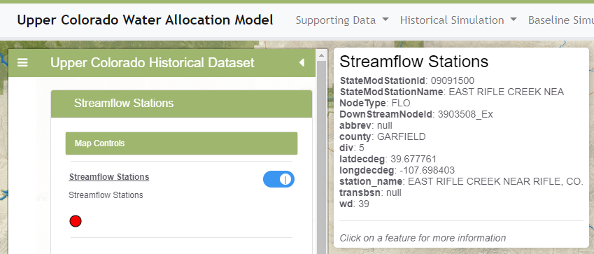

# Map Event Configuration Files #

* [Introduction](#introduction)
* [Hover Event](#hover-event)
* [Click Event](#click-event)
* [Configuration](#configuration)

--------------------

## Introduction ##

A map configuration file created by GeoProcessor software
can contain an event handler section for GeoLayerView,
with event handler configuration as discussed below.
This allows interaction with map layers,
such as hovering over features or clicking on features in order to view additional information.

One or more event handlers can be added to a GeoMapProject using the GeoView
[`SetGeoLayerViewEventHandler`](http://software.openwaterfoundation.org/geoprocessor/latest/doc-user/command-ref/SetGeoLayerViewEventHandler/SetGeoLayerViewEventHandler/) command.
Default event handlers are often sufficient for many layers, especially when additional interaction is not needed.

## Hover Event ##

An `eventType` of `hover` will cause a transient popup to display,
which shows attributes for the layer feature over which hovering occurs.
The hover event type is enabled by default and displays the attributes for the feature under the hover device, typically a mouse.
The following illustrates a hover popup.

**<p style="text-align: center;">

</p>**

**<p style="text-align: center;">
Example Popup for Hover Event (<a href="../images/hover-popup.png">see full-size image</a>)
</p>**

## Click Event ##

An `eventType` of `click` is associated with popup that can be configured to show attributes for the layer feature
that was clicked on (the default), and optionally show buttons that when clicked on will cause other actions such as displaying a graph.

```
  "eventHandlers": [
    {
      "eventType": "click",
      "name": null,
      "description": "",
      "properties": {
        "popupConfigPath": "graphs/diversion-popup-config.json"
      }
    }
  ]
```

The popup configuration file specified by `popupConfigPath` property
indicates the appearance and functionality of the popup.
Currently, the GeoProcessor does not provide a command to create a popup configuration file
and therefore it must be created with a text editor.
The following is an example of a popup configuration file.
In this case the popup will list all attributes for the feature that has been
clicked on and will display buttons that trigger actions.

```
{
  "id" : "diversion-popup-config",
  "name": "Diversion popup configuration",
  "description":  "List main attributes and provide buttons to graph time series.",
  "layerAttributes" : {
    "include" : [ "*" ],
    "exclude" : [],
    "formats": []
  },
  "actions": [
      {
        "label" : "Demand",
        "action" : "displayTimeSeries",
        "resourcePath" : "graphs/diversion-DiversionDemand-graph-config.json"
      },
      {
        "label" : "Historical",
        "action" : "displayTimeSeries",
        "resourcePath" : "graphs/diversion-DiversionHistorical-graph-config.json"
      },
      {
        "label" : "Available Flow",
        "action" : "displayTimeSeries",
        "resourcePath" : "graphs/diversion-Available_Flow-graph-config.json"
      },
      {
        "label" : "Combination",
        "action" : "displayTimeSeries",
        "resourcePath" : "graphs/diversion-combination-graph-config.json"
      },
      {
        "label" : "Diversion Summary",
        "action" : "displayText",
        "resourcePath" : "/data-ts/output/xdd/${featureAttribute:StateModStationId}.H2.xdd"
      }
  ]
}
```

For example, the popup will display similar to the following:

**<p style="text-align: center;">

</p>**

**<p style="text-align: center;">
Example Popup for Click Event (<a href="../images/click-popup.png">see full-size image</a>)
</p>**

### Configuration File Properties ###

The main properties of a popup configuration file are described in the following table.

**<p style="text-align: center;">
Popup Configuration File Main Properties
</p>**

| **Property**&nbsp;&nbsp;&nbsp;&nbsp;&nbsp;&nbsp;&nbsp;&nbsp;&nbsp;&nbsp;&nbsp;&nbsp;&nbsp;&nbsp;&nbsp;&nbsp;&nbsp;&nbsp; | **Description** | **Default** |
| -- | -- | -- |
| `id` | Identifier for the popup configuration, which can be used internally by software. | |
| `name` | Name for the popup configuration that can be displayed, for example to allow a user to select a configuration file. | |
| `description` | Description for the popup configuration that can be displayed, for example to help a user understand the popup. | |
| `layerAttributes` | Indicates which attributes to display and how to format those attributes (see below). | |
| `actions` | A list of actions that can be triggered by selecting buttons displayed in the popup (see below). | |

The following table describes properties for `layerAttributes`.

**<p style="text-align: center;">
Popup Configuration File `layerAttributes` Properties
</p>**

| **Property** | **Description** | **Default** |
| -- | -- | -- |
| `include` | An array of string patterns indicating which layer attributes to include in the popup. | Include all attributes. |
| `exclude` | An array of string patterns indicating which layer attributes to exclude in the popup, which will be processed after `include`. | Include all attributes. |
| `formats` | An array of properties defining how to format attributes.  **Need to define.** | Use default string representation of attributes. |

**<p style="text-align: center;">
Popup Configuration File `actions` Properties
</p>**

| **Property**&nbsp;&nbsp;&nbsp;&nbsp;&nbsp;&nbsp;&nbsp;&nbsp;&nbsp;&nbsp;&nbsp;&nbsp;&nbsp;&nbsp;&nbsp;&nbsp;&nbsp;&nbsp; | **Description** | **Default** |
| -- | -- | -- |
| `action`<br>**required**</br> | The action type, indicating what will happen with the popup button is pressed:<ul><li>`displayTimeSeries` (previously was `graph`) - display a time series product specified by TSTool JSON graph configuration file</li><li>`displayText` - display a text file using a popup with fixed-format font</li></ul>. | None - must be specified. |
| `chartPackage` | The chart package to use for graphs:<ul><li>`ChartJS`</li><li>`plotly`</li></ul> | `plotly` |
| `label`<br>**required**</br> | The button label shown in the popup. | None - must be specified. |
| **Proposed:** `modal` | Whether or not the popup window is modal: `false` or `true`. | `true` |
| **Proposed:** `outputComponent` | Output destination:<ul><li>`Popup` - display as popup (see also `modal`)</li><li>**Proposed:** `Tab` - display in a new tab</li><li>**Proposed:** `Window` - display in a new Window</li></ul> | `Popup` |
| `resourcePath`<br>**required**</br> | The path to the data resource:<ul><li>for `action=displayTimeSeries`, specify a TSTool JSON graph configuration file for time series product</li><li>for `action=displayText`, specify the path to a text file to display</li></ul><br>The `productPath` property that was previously used  with time series graphs has been deprecated. | None - must be specified. |
