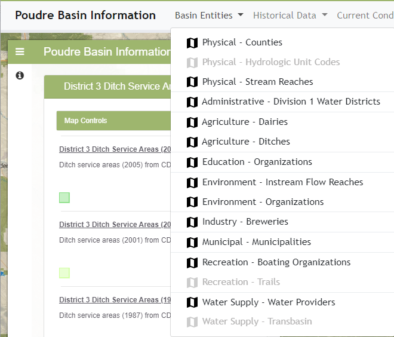
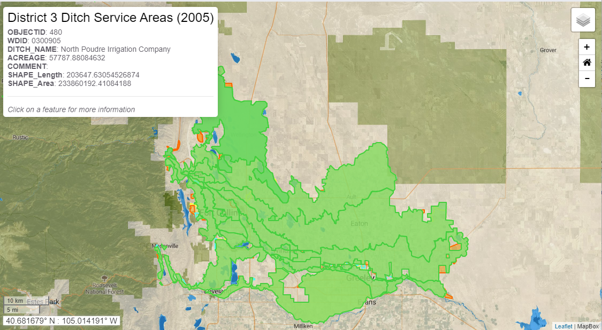
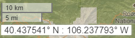
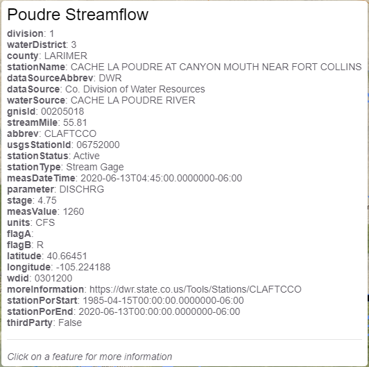
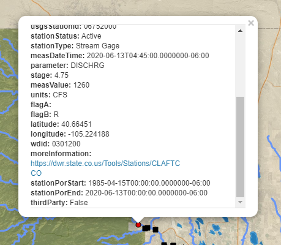
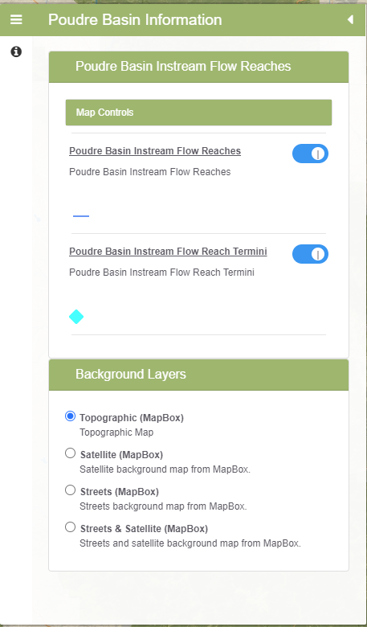

# InfoMapper / Features #

This page describes InfoMapper features.

## Introduction ##

The InfoMapper application provides access to maps, narrative content pages, links to other websites,
and other content.

**<p style="text-align: center;">

</p>**

**<p style="text-align: center;">
InfoMapper Main Interface (<a href="../images/InfoMapper-main.png">see full-size image</a>)
</p>**

## Browser Interactions ##

The InfoMapper is a self-contained application within a web browser.
Because of the way that web browsers are designed,
there is a separation of actions initiated in the web browser
(e.g., the URL search tool, browser refresh button, forward and back buttons, and other browser buttons and tools)
and the features of the InfoMapper (e.g., menus, map interactions, content page links).

The InfoMapper uses a concept of "routing" URLs to software features.
Because the InfoMapper is a single page application,
the main URL causes the application to load,
and variations on the URL cause different content within the application to be shown.
For example, the following URL illustrates the main application URL
(`http://poudre.openwaterfoundation.org/latest/`) and
a page that is handled by internal application routing (`/map/entities-ditches`):

```
http://poudre.openwaterfoundation.org/latest/#/map/entities-ditches
```

The special hash character in the URL (`#`) is used by the application to
separate the main URL from content within the application.
Loading the application using the application URL
(`http://poudre.openwaterfoundation.org/latest/`) will display the home page.
Loading the application using a more detailed URL
(e.g., `http://poudre.openwaterfoundation.org/latest/#/map/entities-ditches`) will
load the application and then display the specific content corresponding to the URL.

The web browser and InfoMapper features are integrated as follows.

**<p style="text-align: center;">
Web Browser and InfoMapper Interactions
</p>**

| **User Action**&nbsp;&nbsp;&nbsp;&nbsp;&nbsp;&nbsp;&nbsp;&nbsp;&nbsp;&nbsp;&nbsp;&nbsp;&nbsp;&nbsp;&nbsp;&nbsp;&nbsp;&nbsp;&nbsp;&nbsp;&nbsp;&nbsp;&nbsp;&nbsp;&nbsp;&nbsp;&nbsp;&nbsp;&nbsp;&nbsp; | **Software Response** | **Planned Enhancement** |
| -- | -- | -- |
| Refresh (reload) the browser page. | Because the browser is in control, this will reload the InfoMapper and the current InfoMapper state will be lost. |  Enhancements are being implemented to confirm that the user wants to reload the page, and to remember important settings so that they can be re-applied after the page reloads. |
| Click on content page links that leave the InfoMapper and then use the browser "back" button. | Similar to reloading the page, if the browser window changes to another page, the current InfoMapper application state will be lost.  Using the back arrow in the web browser will cause the InfoMapper to reload for the link that is active, but  dynamic settings will reset to the initial values for the URL when the page loads. | InfoMapper content page link features are being enhanced to implement opening links in a new tab to ensure that the InfoMapper current state is not lost. |

## Menus ##

The InfoMapper provides menus to access maps, external pages, and other information products.
Menus are organized into top-level menus and sub-menus.

**<p style="text-align: center;">

</p>**

**<p style="text-align: center;">
Menu to Access Information Products (<a href="../images/menus.png">see full-size image</a>)
</p>**

An InfoMapper implementation will typically use an application configuration that organizes
menus according to some strategy, for example general to specific, different timescales, etc.
Menus can also contain separator lines to group menus.

Menus each have a corresponding icon that indicates the action that will occur when the menu is selected,
as described in the following table.

**<p style="text-align: center;">
Menu Icons and Corresponding Actions
</p>**

| **Menu Icon** | **Menu Action** |
| -- | -- |
|  | Display a map. |
|  | Open a link in a new tab. |

## Map ##

The InfoMapper provides maps to view spatial data and access other data.

**<p style="text-align: center;">

</p>**

**<p style="text-align: center;">
InfoMapper Map Interface (<a href="../images/map.png">see full-size image</a>)
</p>**

The map area of the InfoMapper displays a map that is selected from a menu.
A map can be implemented as a thematic map with one or a few layers,
which focuses on specific perspective.
A map can also be more complicated and show many layers.
The layers displayed in the map are described in the map legend shown on the left
(see the [Map Legend and Tools](#map-legend-and-tools) section).

The map interface is intended to be simple and intuitive.
InfoMapper map features are summarized in the following table.

**<p style="text-align: center;">
InfoMapper Map Feature
</p>**

| **Feature**&nbsp;&nbsp;&nbsp;&nbsp;&nbsp;&nbsp;&nbsp;&nbsp;&nbsp;&nbsp;&nbsp;&nbsp;&nbsp;&nbsp;&nbsp;&nbsp;&nbsp;&nbsp;&nbsp;&nbsp;&nbsp;&nbsp;&nbsp;&nbsp;&nbsp;&nbsp;&nbsp;&nbsp;&nbsp;&nbsp;&nbsp;&nbsp;&nbsp;&nbsp;&nbsp;&nbsp;&nbsp;&nbsp;&nbsp;&nbsp; | **Description** |
| -- | -- |
| <br>(upper right) | Select the background map layer. Background layers use various public tile servers with imagery containing different information, such as topographic maps, satellite imagery, and roads. |
| <br>(upper right) | Tools include the following, listed top to bottom:<ul><li>zoom in (plus sign)</li><li>zoom to initial extent (home icon)</li><li>zoom out (minus sign)</li></ul>. |
| <br>(lower left) | Map scale and mouse coordinates in decimal degrees.  See [Decimal degrees article on Wikipedia](https://en.wikipedia.org/wiki/Decimal_degrees) for information about decimal degrees and distance. |
| Hand (with index finger) | Used to identify or select map features to display more information, active when over a layer. |
| Hand (with fingers spread) | Used to pan (reposition) the map by holding down and dragging, active when dragging the map by holding down the mouse button. |

### Mouseover Popup ###

Maps are configured by default to display layer feature information
when the device pointer (such as mouse) is positioned over a feature,
for example as shown below.
This allows information for features to be quickly scanned without clicking on a feature.
Because the popup cannot be clicked on, attributes that are links cannot be clicked on.

**<p style="text-align: center;">

</p>**

**<p style="text-align: center;">
InfoMapper Map Mouse-over Popup (<a href="../images/map-mouseover-popup.png">see full-size image</a>)
</p>**

### Mouse Click Popup ###

Maps are configured by default to display layer feature information
when the device pointer (such as mouse) is clicked on a feature.
This allows information for features to be displayed and links to be followed.
Clicking on a link will open the page in a new tab.

**<p style="text-align: center;">

</p>**

**<p style="text-align: center;">
InfoMapper Map Mouse Click Popup (<a href="../images/map-mouseclick-popup.png">see full-size image</a>)
</p>**

Popups may also provide buttons and other controls
to display built-in viewing tools such as time series visualizations.

## Map Legend and Tools ##

When a map is shown, a legend panel is shown to the left of the map, as shown in the following figure.
The legend can be hidden by pressing the arrow in the legend title and can be expanded by pressing the
menu icon on the left side of the legend title.
The text in the legend panel title areas can also be clicked to compress and expand the legend areas.
The legend area also provides controls to hide/show layers and hide/show layer descriptions.

**<p style="text-align: center;">

</p>**

**<p style="text-align: center;">
InfoMapper Map Legend (<a href="../images/map-legend.png">see full-size image</a>)
</p>**

The legend panel lists layer groups and layers within each group.
Maps can be configured to use multiple groups to organize map layers.
The groups are listed in the order that they are draw,
with layer groups that are listed on top being drawn on the top of the map.
Similarly, layers within a group are listed in the order of drawing.
Layer groups and layers are typically ordered as follows,
consistent with the drawing (rendering) order.
Layers can also be configured as transparent.

* Background layers on bottom.
* Raster layers next.
* Polygon layers next.
* Line layers next.
* Point layers on top.

The legend displays the symbol(s) used for each layer.
Symbols are configured for each layer using one of the following classification types:

**<p style="text-align: center;">
Layer Symbol Classification Types
</p>**

| **Symbol Classification Type** | **Description** |
| -- | -- |
| Single symbol | A single symbol is used for all features in a layer, for example all lines in a river layer. |
| Category | Colors and other properties correspond to discrete feature attribute values, for example different colors for each crop type. |
| Graduated | Colors and other properties correspond to to ranges of values, for example water level. |

Icons for tools are provided on the left side of the map legend.  **These features are being implemented.** 

## Content Pages ##

Content pages are shown if a menu action is configured to display a content page.
The page shows text and links, similar to typical web page.
