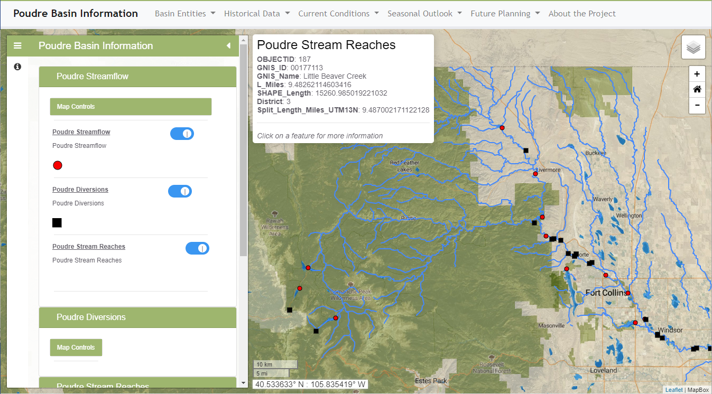

# InfoMapper / Introduction #

This section of the documentation provides background information about the InfoMapper and
concepts that are used throughout the documentation.
See the [Getting Started](../getting-started/getting-started.md) section for information
about using the software.

* [Need for the InfoMapper](#need-for-the-infomapper)
* [User Interface Overview](#user-interface-overview)
* [Concepts](#concepts)
	+ [Map Configurations](#map-configurations)
	+ [Events](#events)
* [Alternatives to the InfoMapper](#alternatives-to-the-infomapper)
* [Next Steps](#next-steps)

--------------

## Need for the InfoMapper ##

The InfoMapper has been created to meet needs related to publishing, maps, 
time series, and other information products.

* There is often a need to automate publishing of visual information products,
in particular when data and information are updated on a schedule or an application
is scaled to multiple implementations.
Existing publishing tools may rely too much on interactive editing and configuration.

* There is a need for web applications that can provide advanced configurable features
without requiring programming skills.

* There is often a need to share and version control workflows.
The InfoMapper integrates with information products produced by version-controlled workflows.

* There is a need to easily scale.
The InfoMapper is designed to handle configurations with multiple maps and visualizations.

* The cost of commercial software may be a barrier to adopting geographic information system (GIS) tools
and web visualization tools,
in particular for organizations that use the software on a limited basis.
The InfoMapper and other OWF software products such as GeoProcessor are intended as production tools
for entities that do not have funding for software licenses.
There is a cost to learn and implement software, and those costs vary depending on skill and application complexity.
However, much of the effort is spent understanding data and workflows.
The InfoMapper and other OWF tools also work with commercial software,
for organizations that use commercial software.

* There is a need for tools that can visualize spatial data without extensive GIS skills.
The InfoMapper is designed to publish data using general terminology.

* There is a need to utilize inexpensive web services infrastructure such as
Content Delivery Networks (CDNs) to publish information products.
The InfoMapper approach works with these services to implement solutions that have low recurring costs.

## User Interface Overview ##

The InfoMapper is a web application and is therefore constrained by the functionality of modern web browsers.
The following illustrates a typical application.

**

**

**

InfoMapper User Interface Example (<a href="../images/InfoMapper-main.png">see full-size image</a>)

**

The following summarizes UI features:

* The InfoMapper is a "single page website" meaning that all functionality is accessed from a single page.
	+ The application behaves similarly to a desktop application.
	+ Popup windows show content and are then closed.
	+ Additional tabs may be used for some content but the main features are contained to one web page.
* The application title is shown on the left side of the menu bar.
* Horizontal menus at the top list main areas of information.
	+ Each main menu has menu items that can be configured to display maps, narrative content pages, visualizations,
	or other content.

## Concepts ##

The following are concepts that are used throughout the InfoMapper and this documentation.

### Map Configurations ###

The InfoMapper relies heavily on map configurations to describe map products.
Typical GIS software map configurations, such as those used with QGIS and ArcGIS, are complicated,
files may be very large, and can be difficult to automate.
The InfoMapper uses [GeoMapProject](http://software.openwaterfoundation.org/geoprocessor/latest/doc-user/appendix-geomapproject/geomapproject/)
files created by OWF GeoProcessor software to describe maps.
These map configurations are JSON files that describe project type,
map, layers, groups of layers, and symbols for layers.
Map configurations are typically created with automated workflows,
which allows map configurations to be updated and modified.
Supporting data such as time series associated with map layers
and data tables are also processed with an automated workflow.

The InfoMapper implements software features using open source Leaflet and other tools to display maps and provide
interaction features (see next [Events](#events) section).

### Events ###

The GeoMapProject configurations contain information to describe
[map events](http://software.openwaterfoundation.org/geoprocessor/latest/doc-user/appendix-geomapproject/geomapproject/#geolayervieweventhandler),
which are user interactions.
For example, mousing over a layer feature may display a popup with information.
Clicking on a feature may provide more detailed data and links to other information.

The InfoMapper provides general features to handle such events.
Although more complex event actions may be implemented over time,
the focus of the InfoMapper is to provide predictable behavior and intuitive interfaces.

## Alternatives to the InfoMapper ##

Alternatives to the InfoMapper should be considered where the InfoMapper does not satisfy requirements.
The goal of the InfoMapper is to provide a cost-effective way to publish information products using open data formats.

Commercial solutions include, for example:

* [Esri ArcGIS Online](https://www.arcgis.com/)
* [Tableau](https://www.tableau.com/)

Many open source tools exist but may require effort to integrate multiple tools.

## Next Steps

The remainder of this documentation describes how to install and use the InfoMapper software.
