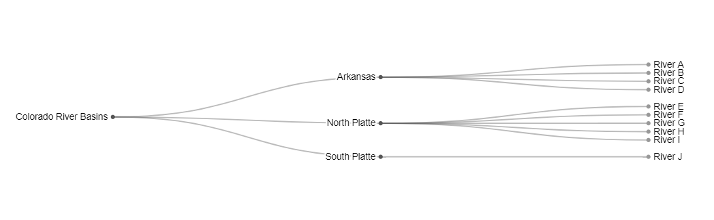
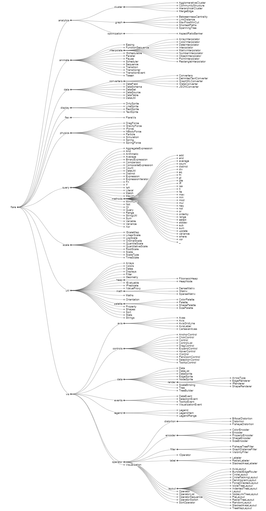

# InfoMapper / Visualizations / Tidy Tree #

## Introduction ##

The InfoMapper utilizes D3 to display the Tidy Tree visualization.
D3 uses the [Reingold-Tilford "tidy" algorithm](https://reingold.co/tidier-drawings.pdf)
for creating trees for displaying hierarchical diagrams. For more information, visit
the [D3 Tidy Tree example](https://observablehq.com/@d3/tidy-tree) page.
The following examples show a simple and advanced Tidy Tree:

<p align="center"><b>Simple Tidy Tree</b></p>


<p align="center"><b>Advanced Tidy Tree</b></p>


## User Interface ##

**To be updated**

## Configuration ##

A JSON file is used to provide the InfoMapper with the necessary information to
be used by D3 when constructing a Tidy Tree. Configuration file examples can be
found under [Data](#data). The following table describes the properties and
values that are utilized.

| Property Name | Description | Default |
| ---- | ---- | ---- |
| `chartType`<br><b>required</b> | Tells the InfoMapper and D3 what kind of visualization is to be constructed. `tidyTree` must be provided to create the Tidy Tree. | None - must be `tidyTree`. |
| `dataPath` | The absolute path, or the path relative to the visualization configuration file for the D3 graph data file. | None - must be specified. |
| `name` | The property name to be used by D3 to be displayed for each Tree element. | `name` |
| `parent`<br><b>Used only with CSV data</b> | The property name to be used by D3 that describes each Tree element's parent. | `parent` |
| `children`<br><b>Used only with JSON data</b> | The property name to be used by D3 whose nested elements will be used as the current Treemap element's descendants. | `children` |
| `title` | The title to be displayed above the visualization. | None |
| `height` | The height of the visualization in pixels. | 500 |
| `width` | The width of the visualization in pixels. | 500 |

## Data ##

The InfoMapper supports both CSV and JSON data formats.

#### CSV ####

CSV data files can be created with only two columns: One for displaying on the visualization,
and another for telling D3 what the element's parent is. Each must be declared in
the configuration file using the properties `name` and `parent`.

An example CSV data file to create the simple Tidy Tree above:

```csv
Basin,Parent Basin
Colorado River Basins
Arkansas,Colorado River Basins
North Platte,Colorado River Basins
South Platte,Colorado River Basins
River A,Arkansas
River B,Arkansas
River C,Arkansas
River D,Arkansas
River E,North Platte
River F,North Platte
River G,North Platte
River H,North Platte
River I,North Platte
River J,South Platte
```

Because Basin and Parent Basin is desired for the Tree's element name and parent
respectively, the configuration would contain the following properties:

```json
{
  "name": "Basin",
  "parent": "Parent Basin"
}
```

#### JSON ####

In general, JSON data needs to be set up like the example below. The top level
property represents the Colorado Water Basins. The basins that it contains are
the North & South Platte, and Arkansas; it's children. Each basin contains
rivers. The "name" and "children" property names can be arbitrarily named,
but the general set up of an attribute and one or more attributes it contains
should be used. The JSON data file will be directly used by D3 to create the
Tidy Tree.

>NOTE: Although the below properties can be named differently than the example,
once a name has been decided, it must be the same for each use of that property.
For example, if "name" is changed to "Attribute", all subsequent uses of "name"
must also be "Attribute". If children is changed to "Basin Features", it must
also be used everywhere else.

An example JSON data file to create the simple Tidy Tree above:

```json
{
  "name": "Colorado Water Basins",
  "children": [
    {
      "name": "South Platte Basin",
      "children": [
        { "name": "River A" },
        { "name": "River B" },
        { "name": "River C" },
        { "name": "River D" }
      ]
    },
    {
      "name": "Arkansas Basin",
      "children": [
        { "name": "River E" },
        { "name": "River F" },
        { "name": "River G" },
        { "name": "River H" },
        { "name": "River I" }
      ]
    },
    {
      "name": "North Platte Basin",
      "children": [
        { "name": "River J" }
      ]
    },
    {
      "name": "Colorado Basin",
      "children": [
        { "name": "River K" },
        { "name": "River L" },
        { "name": "River M" }
      ]
    }
  ]
}
```