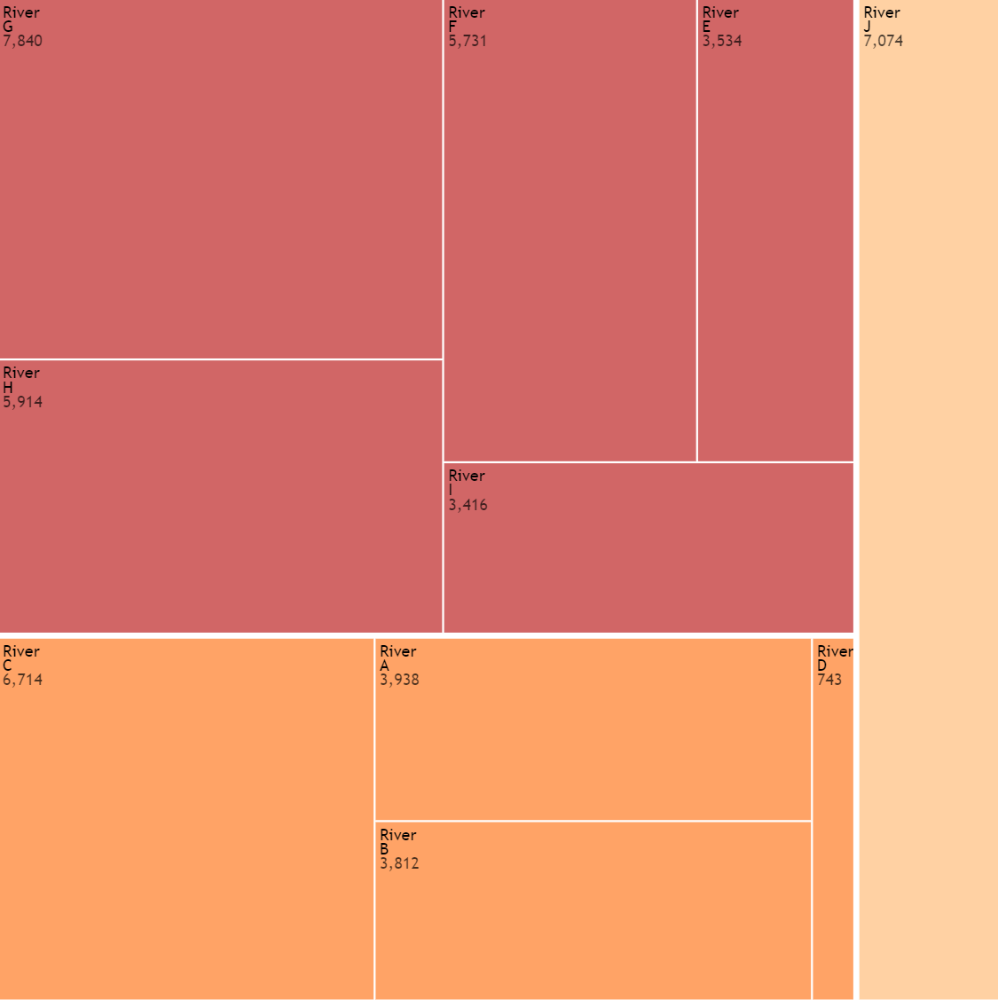
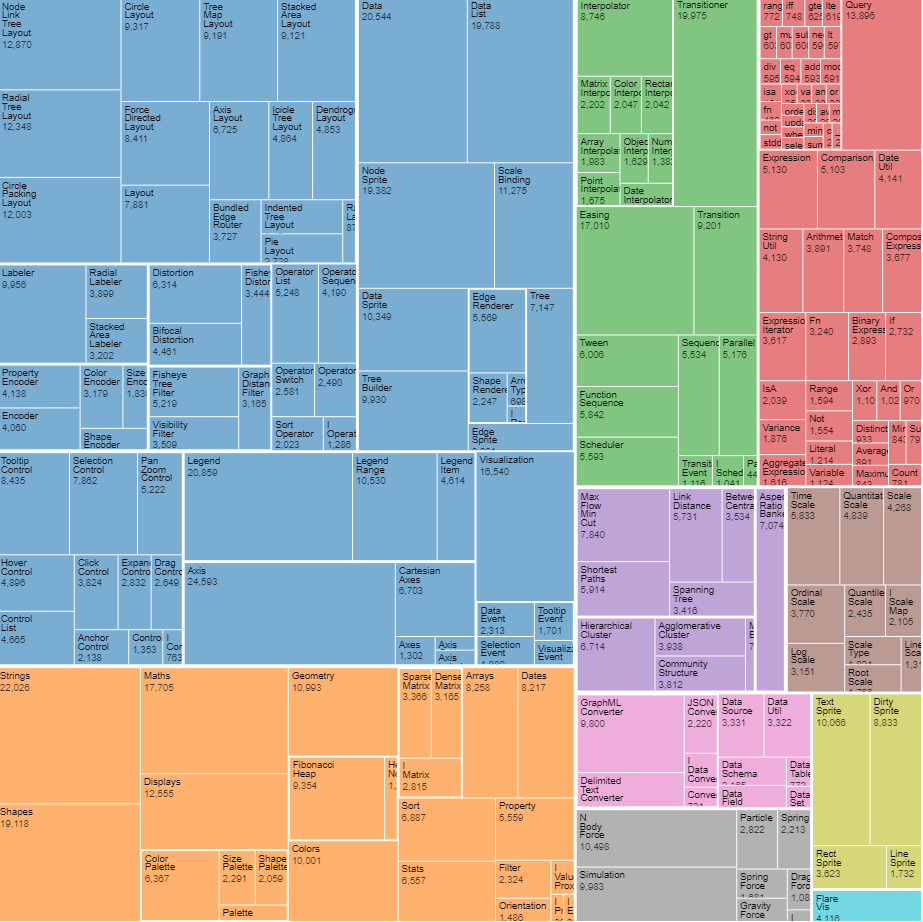

# InfoMapper / Visualizations / Treemap #

## Introduction ##

The InfoMapper utilizes D3 to display the Treemap visualization. Treemaps recursively 
partition space into rectangles according to each data element's associated value. D3
supports multiple types of tiling methods and Treemaps. InfoMapper makes use of the
static Treemap with the squarify tiling method. This produces a Treemap that is not
non-interactive, and attempts to create a square of each data group.
The following examples show a simple and advanced Tidy Tree:

<p align="center"><b>Simple Treemap</b></p>


<p align="center"><b>Advanced Treemap</b></p>


## User Interface ##

**To be updated**

## Configuration ##

A JSON file is used to provide the InfoMapper with the necessary information to
be used by D3 when constructing a Treemap. Configuration file examples can be
found under [Data](#data). The following table describes the properties and
values that are utilized.

| Property Name | Description | Default |
| ---- | ---- | ---- |
| `chartType`<br><b>required</b> | Tells the InfoMapper and D3 what kind of visualization is to be constructed. `tidyTree` must be provided to create the Tidy Tree. | None - must be `treeMap`. |
| `dataPath` | The absolute path, or the path relative to the visualization configuration file for the D3 graph data file. | None - must be specified. |
| `name` | The property name to be used by D3 whose values will be displayed for each Treemap element. | `name` |
| `parent`<br><b>Used only with CSV data</b> | The property name to be used by D3 that describes each Treemap element's parent. | `parent` |
| `children`<br><b>Used only with JSON data</b> | The property name to be used by D3 whose nested elements will be used as the current Treemap element's descendants. | `children` |
| `value` | The property name to be used by D3 to  | `value` |
| `title` | The title to be displayed above the visualization. | None |
| `height` | The height of the visualization in pixels. | 500 |
| `width` | The width of the visualization in pixels. | 500 |

## Data ##

The InfoMapper supports both CSV and JSON data formats.

#### CSV ####

CSV data files can be created with only two columns: One for displaying on the visualization,
and another for telling D3 what the element's parent is. Each must be declared in
the configuration file using the properties `name` and `parent`.

An example CSV data file to create the simple Treemap above:

```csv
Basin,Parent Basin,Water
Colorado River Basins
Arkansas,Colorado River Basins
North Platte,Colorado River Basins
South Platte,Colorado River Basins
River A,Arkansas,3938
River B,Arkansas,3812
River C,Arkansas,6714
River D,Arkansas,743
River E,North Platte,3534
River F,North Platte,5731
River G,North Platte,7840
River H,North Platte,5914
River I,North Platte,3416
River J,South Platte,7074
```

Because Basin, Parent Basin, and Water is desired for the Tree's element name, parent,
and value respectively, the configuration would contain the following properties:

```json
{
  "name": "Basin",
  "parent": "Parent Basin",
  "value": "water"
}
```

#### JSON ####

In general, JSON data needs to be set up like the example below. The top level
property represents the Colorado Water Basins. The basins that it contains are
the North & South Platte, and Arkansas; it's children. Each basin contains
rivers. The "name", "children" and "value" property names can be arbitrarily named,
but the general set up of an attribute and one or more attributes it contains
should be used. The JSON data file will be directly used by D3 to create the
Tidy Tree. 

An example JSON data file to create the simple Tidy Tree above:

```json
{
  "name": "Colorado Water Basins",
  "children": [
    {
      "name": "South Platte Basin",
      "children": [
        {
          "name": "River A",
          "value": 3938
        },
        {
          "name": "River B",
          "value": 3812
        },
        {
          "name": "River C",
          "value": 6714
        },
        {
          "name": "River D",
          "value": 743
        }
      ]
    },
    {
      "name": "Arkansas Basin",
      "children": [
        {
          "name": "River E",
          "value": 3534
        },
        {
          "name": "River F",
          "value": 5731
        },
        {
          "name": "River G",
          "value": 7840
        },
        {
          "name": "River H",
          "value": 5914
        },
        {
          "name": "River I",
          "value": 3416
        }
      ]
    },
    {
      "name": "North Platte Basin",
      "children": [
        {
          "name": "River J",
          "value": 7074
        }
      ]
    },
    {
      "name": "Colorado Basin",
      "children": [
        {
          "name": "River K",
          "value": 6969
        },
        {
          "name": "River L",
          "value": 1714
        },
        {
          "name": "River M",
          "value": 2997
        }
      ]
    }
  ]
}
```